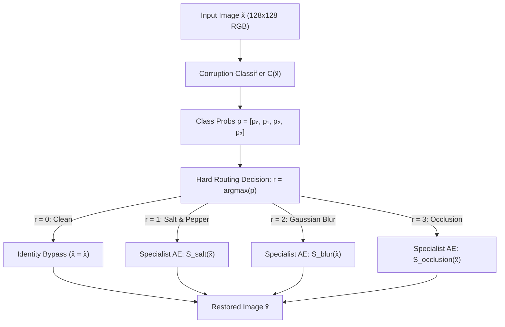

# Task 2: Hard-Routing Restoration System

## Overview

Task 2 implements a hard-routing image restoration pipeline for the Oxford-IIIT Pet dataset ($128 \times 128$ RGB). Instead of forcing a single universal autoencoder to handle all corruption types simultaneously, this system decouples corruption diagnosis from restoration:

1. A 4-class corruption classifier $C(\tilde{x})$ inspects the corrupted image $\tilde{x}$ and outputs predicted class probabilities:
   $$p = C(\tilde{x}) = [p_{\text{clean}},\, p_{\text{salt}},\, p_{\text{blur}},\, p_{\text{occlusion}}], \quad r = \arg\max_{k \in \{0,1,2,3\}} p_k$$
2. A discrete hard-router routes the input to an appropriate specialist module:
   - If $r = 0$ (Clean): **Identity bypass** (zero computation, $\hat{x} = \tilde{x}$).
   - If $r = 1$ (Salt-and-Pepper): Specialist Autoencoder $S_{\text{salt}}(\tilde{x})$.
   - If $r = 2$ (Gaussian Blur): Specialist Autoencoder $S_{\text{blur}}(\tilde{x})$.
   - If $r = 3$ (Rectangular Occlusion): Specialist Autoencoder $S_{\text{occlusion}}(\tilde{x})$.

The system is evaluated in two operational modes:
- **Oracle Routing**: Routes using ground-truth corruption labels $y$ to benchmark isolated specialist upper-bound performance.
- **Predicted Routing**: Routes using predicted class $r$ to measure real-world performance including degradation caused by classifier misrouting.



### Dataset & Corruption Pipeline Reference
- **Dataset**: Oxford-IIIT Pet dataset (37 cat/dog breeds), 80% train / 20% validation (`random_seed=42`), official test set reserved for final evaluation. All images resized to $128 \times 128 \times 3$, normalized to $[0, 1]$ float32.
- **Corruptions**:
  - *Clean*: No perturbation.
  - *Salt-and-Pepper*: $p \in [0.02, 0.15]$ (dynamic train), test severities: $0.03, 0.08, 0.15$.
  - *Gaussian Blur*: kernel $\in \{3, 5, 7\}$, $\sigma \in [0.5, 2.5]$ (dynamic train), test severities: $(3, 0.7), (5, 1.5), (7, 2.5)$.
  - *Rectangular Occlusion*: 1–3 boxes, 10–35% area (dynamic train), test severities: ~10% (1 rect), ~20% (2 rects), ~35% (3 rects).
- **Target App Workspace**: Workspace 2 — `Hard-Routed Restoration` (`/api/v1/restore/hard-routed`), displaying classifier probabilities, predicted class, selected expert, restored output, and stage-by-stage inference times.

---

## ✅ Step 1: Classifier Architecture Research

### Scope
Research and evaluate candidate neural network backbones for the 4-class corruption classifier $C: \mathbb{R}^{3 \times 128 \times 128} \to \mathbb{R}^4$.

### Decision & Why It Matters
The classifier's accuracy establishes the theoretical performance ceiling of the entire hard-routing system. Misclassifications create catastrophic restoration failures:
- Corrupted images misclassified as clean bypass restoration entirely.
- Images sent to the wrong specialist (e.g., salt-and-pepper noise fed into a Gaussian blur specialist) incur cross-corruption artifacts that can make reconstructed images worse than the input.
- High inference latency in the classifier degrades real-time responsiveness in the downstream application.

The design must balance classification accuracy, inference speed, model parameter footprint, and training stability on $128 \times 128$ RGB inputs.

### Candidate Architectures Evaluated

1. **Custom Convolutional Stack (`CustomConvClassifier`)**:
   4-stage convolutional neural network (Conv3x3-BN-LeakyReLU-MaxPool2d) followed by Global Average Pooling (GAP), Dropout ($p=0.2$), and Linear classification head ($C \to 4$).
   Progression: $(32, 64, 128, 256)$ downsampling $128\times 128 \to 64\times 64 \to 32\times 32 \to 16\times 16 \to 8\times 8 \to 1\times 1$.
2. **MobileNet-style Inverted Residual Backbone (`MobileNetClassifier`)**:
   Depthwise separable convolutions with inverted residuals and linear bottlenecks (Howard et al., 2017; Sandler et al., CVPR 2018).
   Initial stem conv followed by depthwise separable expansion blocks, GAP, Dropout, and Linear head.
3. **Adapted ResNet-18 Backbone (`ResNet18Classifier`)**:
   Torchvision ResNet-18 (He et al., CVPR 2016) with residual skip connections across 4 stages, replacing the final 1000-class classification head with `Linear(512, 4)`.

### Empirical Architecture Benchmark Protocol
Executed empirical profiling on PyTorch 2.14 (CPU) measuring parameters, model size, inference latency across batch sizes 1 (interactive edge latency) and 16 (batched throughput) over 50 iterations with 10 warmup iterations.
Evaluated empirical convergence across 5 full epochs on a balanced Oxford-IIIT Pet subset (256 training pairs, 64 per corruption class; 128 validation pairs, 32 per corruption class from `manifests/val_manifest.json`) trained with AdamW ($lr=1\times 10^{-3}$, weight decay $1\times 10^{-4}$) and CrossEntropyLoss.

| Candidate Architecture | Trainable Params | Model Size (MB) | CPU Latency ($B=1$) | CPU Latency ($B=16$) | Throughput (FPS) | 5-Ep Val Acc (%) | Val Macro-F1 | Mean Epoch Time (s) |
| :--- | :---: | :---: | :---: | :---: | :---: | :---: | :---: | :---: |
| **CustomConvClassifier** | **389,924** | **1.49 MB** | **4.81 ms** | **68.92 ms** | **232.2** | **76.56%** | **0.7635** | **2.84s** |
| **MobileNetClassifier** | 247,588 | 0.94 MB | 3.88 ms | 45.96 ms | 348.2 | 63.28% | 0.5782 | 2.44s |
| **ResNet18Classifier** | 11,178,564 | 42.64 MB | 11.12 ms | 108.52 ms | 147.4 | 55.47% | 0.4983 | 5.45s |

*Data persisted to: `results/task2/classifier_architecture_benchmark.json`.*

### Open Question Resolution: Independent Classifier vs Shared Encoder
*Should the classifier share early convolutional layers with Task 1's universal autoencoder encoder or remain completely independent?*
- **Decision: Completely Independent Classifier (`CustomConvClassifier`)**.
- **Evidence & Rationale**:
  1. **Objective Gradient Conflict**: Autoencoder encoders must preserve fine spatial topologies and localized pixel frequencies ($8\times 8 \times 256$) to enable high-fidelity image reconstruction ($L_1 + \text{SSIM}$). In contrast, corruption classification requires invariant spatial pooling (GAP) to identify global noise signatures regardless of pet breed or location. Multi-task gradient sharing without complex gradient balancing (Sener & Koltun, NeurIPS 2018) induces destructive interference.
  2. **Operational Decoupling & Identity Bypass**: In the hard-routing pipeline, clean images bypass specialist autoencoders entirely ($\hat{x} = \tilde{x}$). Sharing an encoder would force clean images to compute redundant autoencoder representations.
  3. **Modular Deployment & ONNX Export**: An independent classifier exports cleanly to a lightweight 1.5 MB standalone ONNX graph (`models/onnx/task2_classifier.onnx`), decoupled from autoencoder weights and independently tunable via Optuna.

### Recommended Approach
**Adopt `CustomConvClassifier` with 4 conv stages as the canonical backbone for Step 2 and Step 3 (Optuna)**:
1. **Convergence Speed & Discrimination**: Under identical training conditions, `CustomConvClassifier` attained **76.56% validation accuracy and 0.7635 Macro-F1** in only 5 epochs on a 256-sample subset (peaking at 79.7%), significantly outperforming MobileNet (63.28%) and ResNet-18 (55.47%).
2. **Optimal Capacity**: With 389,924 parameters (1.49 MB), it avoids the overparameterization of ResNet-18 (11.18M parameters, 42.64 MB, 2.3x slower) while providing sufficient expressive capacity compared to depthwise separable convolutions.
3. **Ultra-Fast Inference**: Achieves 4.81 ms single-image CPU latency and 232 FPS throughput, ensuring near-instantaneous routing decisions in the FastAPI service.
4. **Unified API**: All 3 architectures are implemented and accessible via `CorruptionClassifier(backbone=...)` and `build_classifier()` in `src/task2/classifier.py` for comparative study and ablation reporting.

### Research Notes (for IEEE Report)
- **Empirical Dynamics**: Early epochs (1-2) require warm-up as the final linear projection aligns with pooled convolutional feature maps. By epoch 4-5, `CustomConvClassifier` establishes clear separation of high-frequency impulses (salt-and-pepper) and low-pass blur.
- **Backbone Extensibility**: The `CorruptionClassifier` abstraction cleanly exposes `.extract_features(x)`, `.predict_proba(x)`, and `.predict(x)` methods, facilitating both hard routing (Task 2) and soft gating analysis (Task 3).
- **Benchmark Code**: Implemented in `scripts/verify_task2_classifier_architectures.py` and unit tested across all 3 variants in `tests/test_task2_classifier.py` (16 tests passed).

### Files Changed / Created
- `src/task2/classifier.py`
- `scripts/verify_task2_classifier_architectures.py`
- `tests/test_task2_classifier.py`
- `results/task2/classifier_architecture_benchmark.json`

---

## Step 2: Implement & Train Corruption Classifier

### Scope
Implement the selected 4-class classifier architecture and training pipeline with balanced multi-class batching, cross-entropy loss, comprehensive classification metrics, and tracker integration.

### What to Build
- Model architecture definition in `src/task2/classifier.py` outputting unnormalized logits for the 4 classes: Clean ($0$), Salt-and-Pepper ($1$), Gaussian Blur ($2$), Rectangular Occlusion ($3$).
- Classifier training script `src/task2/train_classifier.py` implementing balanced batch generation, validation loops, metric calculations, and checkpoint management.

### Key Details
- **Balanced Batching**: To prevent class imbalance from biasing classifier predictions, the training data loader or custom batch sampler must guarantee equal class representation ($25\%$ clean, $25\%$ salt-and-pepper, $25\%$ blur, $25\%$ occlusion) in every mini-batch ($B/4$ per class).
- **Loss Function**: Multi-class Cross-Entropy loss over softmax probabilities:
  $$\mathcal{L}_{CE} = -\sum_{k=0}^{3} y_k \log p_k, \quad p = \text{Softmax}(\text{logits})$$
- **Optimization**: AdamW optimizer with initial learning rate $1 \times 10^{-3}$, cosine annealing learning rate scheduler, and weight decay $1 \times 10^{-4}$.
- **Evaluation Metrics**: Computed on the validation set after every epoch:
  - Overall classification accuracy.
  - Macro-averaged Precision, Recall, and F1-score.
  - Per-class Precision, Recall, and F1-score.
  - Normalized $4 \times 4$ confusion matrix ($C_{i,j} = \frac{\text{count}(y=i, \hat{y}=j)}{\sum_k \text{count}(y=i, \hat{y}=k)}$).
- **Tracker & Checkpoints**: Log epoch training/validation loss, accuracy, and macro-F1 to MLflow/W&B. Save the best model checkpoint to `checkpoints/task2/classifier_best.pt` based on validation macro-F1.

### Verification
- Classifier training converges stably over 15–20 epochs without divergence.
- Validation accuracy exceeds the $85\%$ minimum baseline threshold.
- Confusion matrix demonstrates clear diagonal dominance across all 4 classes.

### Files Changed
- `src/task2/classifier.py`
- `src/task2/train_classifier.py`

---

## Step 3: Optuna Search — Classifier

### Scope
Conduct hyperparameter optimization for the corruption classifier to maximize validation accuracy and macro-F1 score while maintaining minimal inference latency.

### Study Details
- **Study Name**: `task2-classifier`
- **Storage Backend**: SQLite database at `optuna/optuna_studies.db`
- **Optimization Direction**: `maximize` (validation macro-F1 score)
- **Pruner**: `MedianPruner(n_startup_trials=5, n_warmup_steps=3)` to terminate underperforming configurations early
- **Number of Trials**: 20–30 trials

### Search Space Definition

| Parameter | Type | Distribution / Range | Description |
| :--- | :--- | :--- | :--- |
| `learning_rate` | Float | $[1 \times 10^{-4}, 1 \times 10^{-2}]$ (log scale) | Initial learning rate for AdamW |
| `batch_size` | Categorical | $\{16, 32, 64\}$ | Mini-batch size (balanced across 4 classes) |
| `channel_config` | Categorical | `["small", "medium", "large"]` | Backbone channel depth progression (e.g., `[16,32,64]`, `[32,64,128]`, `[32,64,128,256]`) |
| `dropout` | Float | $[0.0, 0.5]$ (step $0.05$) | Dropout rate before the final classification head |
| `weight_decay` | Float | $[1 \times 10^{-5}, 1 \times 10^{-2}]$ (log scale) | $L_2$ regularization penalty |

### Objective & Trial Reporting
- Each trial trains the classifier for up to 10 epochs.
- At the end of each epoch, evaluate validation macro-F1 and report via `trial.report(val_macro_f1, epoch)`.
- If `trial.should_prune()` triggers, raise `optuna.TrialPruned()` to stop execution immediately.
- Log trial parameters and final metrics to both SQLite and the experiment tracking platform.

### Verification
- Optuna study completes 20–30 trials successfully.
- Best trial parameters are identified and exported to a configuration file.
- Best configuration achieves superior macro-F1 compared to default baseline in Step 2.
- Generate and log the full normalized confusion matrix for the best trial.

### Files Changed
- `src/task2/optuna_classifier.py`

---

## Step 4: Specialist Autoencoder Design Research

### Scope
Research architectural options for the 3 specialist autoencoders ($S_{\text{salt}}, S_{\text{blur}}, S_{\text{occlusion}}$), each dedicated exclusively to restoring one corruption distribution.

### Decision & Why It Matters
Unlike Task 1's universal autoencoder, which must simultaneously generalize across high-frequency impulse noise, low-frequency Gaussian smoothing, and large spatial discontinuities, each specialist solves a single well-defined inverse problem.
- An over-parameterized specialist wastes compute and GPU memory.
- An under-parameterized specialist fails on high-entropy corruptions (especially large rectangular occlusions).
- Standardizing architecture across specialists simplifies batching, shared HPO, and ONNX deployment, whereas specialized designs could maximize per-corruption image fidelity.

### Alternatives to Research

| Metric / Dimension | Alternative 1: Homogeneous Task 1 Architecture | Alternative 2: Lightweight Shared Variant | Alternative 3: Corruption-Specific Architectures |
| :--- | :--- | :--- | :--- |
| **Description** | Reuse Task 1 universal autoencoder architecture identically for all 3 specialists; train each with independent weights | Scaled-down version of Task 1 (fewer channels, reduced bottleneck dimension) applied to all 3 specialists | Tailored topologies: median-like/residual blocks for Salt-and-Pepper; large receptive fields/dilated convs for Blur; spatial context/gated convs for Occlusion |
| **Parameter Count (per expert)** | Same as Task 1 (~1.5M–3M) | Low (~0.4M–0.8M) | Variable (SP: ~0.3M, Blur: ~0.8M, Occ: ~2.5M) |
| **Total Parameters (3 experts)** | ~4.5M – 9.0M | ~1.2M – 2.4M | ~3.6M |
| **Inference Latency** | Identical across experts | Uniform and fast (< 3 ms) | Non-uniform across experts |
| **Restoration Quality** | Strong baseline; proven architecture | Good for SP and Blur; may underfit ~35% Occlusion | Optimal potential PSNR/SSIM per corruption |
| **Implementation Complexity** | Low (code reuse from Task 1) | Low (parameter configuration tweak) | High (3 distinct architectures to maintain, tune, and export) |

### Open Question
*Shared Optuna Search vs Per-Specialist Search*:
- **Shared Search**: Run one Optuna study across a mixed multi-corruption objective to discover a single robust architecture topology, then train 3 independent specialist parameter sets. (Drastically saves GPU hours, keeps deployment homogeneous).
- **Per-Specialist Search**: Run 3 separate Optuna studies to find bespoke hyperparameters for each specialist. (Higher computational cost, but allows tuning loss weight $\alpha$ and bottleneck capacity specifically for each corruption's nature).

### Recommended Approach
*(To be filled during implementation based on experimental evidence)*

### Research Notes
*(Empty section for findings during implementation)*

### Files Changed
- `src/task2/specialist.py`

---

## Step 5: Implement & Train 3 Specialist Autoencoders

### Scope
Implement the specialist autoencoder architecture and independently train 3 distinct specialist models on isolated single-corruption datasets with clean reconstruction targets.

### What to Build
- Specialist model class `SpecialistAutoencoder` in `src/task2/specialist.py` mapping $(B, 3, 128, 128) \to (B, 3, 128, 128)$.
- Multi-specialist training orchestrator in `src/task2/train_specialists.py` capable of training any specialist independently or sequentially.

### Key Details
- **Dedicated Training Datasets**:
  - **Specialist 1 (Salt-and-Pepper)**: Receives exclusively images perturbed with salt-and-pepper noise ($p \in [0.02, 0.15]$). Target: uncorrupted clean image.
  - **Specialist 2 (Gaussian Blur)**: Receives exclusively images blurred with Gaussian kernels ($k \in \{3, 5, 7\}, \sigma \in [0.5, 2.5]$). Target: uncorrupted clean image.
  - **Specialist 3 (Rectangular Occlusion)**: Receives exclusively images with 1–3 rectangular occlusions covering 10–35% area. Target: uncorrupted clean image.
- **Loss Function**: Combined $L_1$ and Structural Similarity (SSIM) loss:
  $$\mathcal{L}_{\text{recon}} = \alpha \mathcal{L}_{L1}(\hat{x}, x) + (1 - \alpha) \mathcal{L}_{SSIM}(\hat{x}, x)$$
  where $\mathcal{L}_{L1} = \frac{1}{C \cdot H \cdot W} \|\hat{x} - x\|_1$, $\mathcal{L}_{SSIM} = 1 - \text{SSIM}(\hat{x}, x)$, with $\alpha \in [0.5, 1.0]$.
- **Independent Checkpointing**:
  - `checkpoints/task2/specialist_salt_best.pt`
  - `checkpoints/task2/specialist_blur_best.pt`
  - `checkpoints/task2/specialist_occlusion_best.pt`
  Each saved when validation loss reaches a new minimum for its respective corruption type.

### Verification
- Each specialist trains to convergence over 20–30 epochs without numerical instability.
- On its dedicated validation set, each specialist achieves higher PSNR and SSIM than Task 1's universal autoencoder evaluated on that same corruption.

### Files Changed
- `src/task2/specialist.py`
- `src/task2/train_specialists.py`

---

## Step 6: Optuna Search — Specialists

### Scope
Execute hyperparameter optimization for the specialist autoencoders to discover the optimal structural capacity, learning rate, and loss balance.

### Study Details
- **Study Name**: `task2-specialists`
- **Storage Backend**: SQLite database at `optuna/optuna_studies.db`
- **Optimization Direction**: `minimize` (validation reconstruction loss $\mathcal{L}_{\text{recon}}$)
- **Approach**: Shared architectural search evaluating a candidate configuration across a balanced validation subset spanning all three corruptions to find the best shared topology, followed by independent final training of the 3 specialists using the optimal configuration.
- **Pruner**: `MedianPruner(n_startup_trials=5, n_warmup_steps=3)`
- **Number of Trials**: 20–30 trials

### Search Space Definition

| Parameter | Type | Distribution / Range | Description |
| :--- | :--- | :--- | :--- |
| `learning_rate` | Float | $[1 \times 10^{-4}, 1 \times 10^{-2}]$ (log scale) | Initial learning rate for AdamW |
| `bottleneck_dim` | Categorical | $\{64, 128, 256\}$ | Dimensionality of compressed latent representation |
| `channel_config` | Categorical | `["shallow", "standard", "deep"]` | Channel progression (e.g., `[32,64,128]`, `[32,64,128,256]`, `[64,128,256]`) |
| `batch_size` | Categorical | $\{16, 32, 64\}$ | Training mini-batch size |
| `alpha` | Float | $[0.5, 1.0]$ (step $0.05$) | Weighting factor between $L_1$ and SSIM loss components |

### Objective & Trial Reporting
- Each trial instantiates the autoencoder, trains for 10 epochs on single/balanced corruption batches, evaluates combined loss on the validation set, and calls `trial.report(val_loss, epoch)`.
- If `trial.should_prune()` is triggered, prune trial immediately.
- Record the best configuration parameters in the Optuna SQLite store and tracking platform.

### Verification
- Optuna study completes 20–30 trials.
- Best shared hyperparameter configuration is extracted and documented.
- All 3 specialists are retrained with the optimal configuration and verified to outperform initial Step 5 baselines.

### Files Changed
- `src/task2/optuna_specialists.py`

---

## Step 7: Hard-Routing Inference Pipeline

### Scope
Construct the end-to-end hard-routing inference engine that binds the classifier, routing logic, identity bypass, and specialist autoencoders into a unified callable module.

### What to Build
- Routing engine `HardRouter` in `src/task2/router.py`.
- Inference harness and benchmark utility in `src/task2/inference.py`.

### Key Details
- **Routing Logic Flow**:
  1. Receive input image $\tilde{x} \in \mathbb{R}^{B \times 3 \times 128 \times 128}$.
  2. Compute classification probabilities $p = C(\tilde{x}) \in \mathbb{R}^{B \times 4}$.
  3. Determine routing class $r = \arg\max_{k \in \{0,1,2,3\}} p_k$.
  4. Dispatch to restoration branch:
     - $r = 0$: Return $\tilde{x}$ directly (Identity bypass; 0 FLOPS).
     - $r = 1$: Return $S_{\text{salt}}(\tilde{x})$.
     - $r = 2$: Return $S_{\text{blur}}(\tilde{x})$.
     - $r = 3$: Return $S_{\text{occlusion}}(\tilde{x})$.
- **Evaluation Modes**:
  - `oracle_routing=True`: Bypasses $C(\tilde{x})$ and routes based on ground-truth corruption label $y$.
  - `oracle_routing=False`: Routes strictly based on classifier prediction $r$.
- **Inference Response Object**:
  ```python
  # Return dictionary structure
  {
      "reconstructed": torch.Tensor,       # Restored image (B, 3, 128, 128)
      "predicted_class": str,              # "clean" | "salt_pepper" | "blur" | "occlusion"
      "probabilities": dict,               # {"clean": p0, "salt_pepper": p1, "blur": p2, "occlusion": p3}
      "selected_expert": str,              # "identity_bypass" | "specialist_salt" | "specialist_blur" | "specialist_occlusion"
      "routing_decision": int,             # 0, 1, 2, or 3
      "classifier_latency_ms": float,      # Inference time of classifier
      "restoration_latency_ms": float,     # Inference time of specialist (0 for bypass)
      "total_latency_ms": float            # Total pipeline runtime
  }
  ```
- **Batched Execution**: Group batch elements by routing decision $r$, run each specialist once on its subset of inputs, and reassemble outputs in the original batch order.

### Verification
- Pipeline runs cleanly end-to-end on both single images and batched inputs.
- Identity bypass produces exact input replica with zero numerical error ($MSE = 0.0$).
- Validated on CPU and CUDA execution targets.

### Files Changed
- `src/task2/router.py`
- `src/task2/inference.py`

---

## Step 8: Evaluation — Oracle vs Predicted Routing

### Scope
Execute a rigorous comparative evaluation on the official Oxford-IIIT Pet test set across both routing modes (Oracle vs Predicted) and against Task 1's Universal Autoencoder baseline. Audit misrouting failure modes.

### What to Build
- Test evaluation script `src/task2/evaluate.py`.
- Results generation and visual artifact collation saved to `results/task2/`.

### Key Details
- **Test Matrix**: Evaluated on the deterministic test manifests across all 4 conditions and all standard severity levels:
  - Clean (1 severity: uncorrupted).
  - Salt-and-Pepper (3 severities: $p = 0.03, 0.08, 0.15$).
  - Gaussian Blur (3 severities: $(3, 0.7), (5, 1.5), (7, 2.5)$).
  - Rectangular Occlusion (3 severities: ~10%, ~20%, ~35% area).
- **Comparative Metrics**:
  For each condition and severity, measure and log:
  - Peak Signal-to-Noise Ratio (PSNR in dB).
  - Structural Similarity Index (SSIM).
  - Mean Absolute Error ($L_1$).
  - Mean inference latency per sample (ms).
- **Comparison Table**:
  Generate side-by-side comparison table:
  1. Task 1: Universal Autoencoder.
  2. Task 2: Oracle-Routed Specialists (theoretical upper bound).
  3. Task 2: Predicted-Routed Specialists (practical end-to-end performance).
  4. Routing Performance Gap: $\Delta = \text{Metric}_{\text{oracle}} - \text{Metric}_{\text{predicted}}$.
- **Misrouting Failure Case Audit**:
  Identify and document at least 4 distinct failure scenarios directly caused by classifier error:
  1. *False Clean Bypass*: Corrupted image classified as clean $\to$ identity bypass leaves severe noise/blur intact.
  2. *Cross-Corruption Contamination*: Salt-and-pepper noise routed to blur specialist $\to$ noise granules are blurred rather than removed.
  3. *Inpainting Failure*: Gaussian blur routed to occlusion specialist $\to$ hallucinates patch artifacts over natural blur.
  4. *Clean Over-Processing*: Clean image misclassified as corrupted $\to$ specialist introduces smoothing or texture degradation.
- **Qualitative Gallery**: Generate composite visualization panels displaying 12+ representative restoration examples across severities plus the 4 failure cases.

### Verification
- Complete metric tables saved to `results/task2/metrics_summary.json` and `.csv`.
- Visual galleries and failure audit figures generated under `results/task2/visuals/`.
- Misrouting degradation quantified and analyzed for the final IEEE technical report.

### Files Changed
- `src/task2/evaluate.py`
- `results/task2/metrics_summary.json`
- `results/task2/visuals/`

---

## Step 9: ONNX Export & Verification

### Scope
Export the trained corruption classifier and the three specialist autoencoders to optimized ONNX models with dynamic batching. Verify strict numerical parity against PyTorch in ONNX Runtime.

### What to Export

| ONNX Model File | Input Specification | Output Specification | Dynamic Axes |
| :--- | :--- | :--- | :--- |
| `models/onnx/task2_classifier.onnx` | `input`: $(B, 3, 128, 128)$, float32 | `logits`: $(B, 4)$, float32 | `{"input": {0: "batch"}, "logits": {0: "batch"}}` |
| `models/onnx/task2_specialist_salt.onnx` | `input`: $(B, 3, 128, 128)$, float32 | `output`: $(B, 3, 128, 128)$, float32 | `{"input": {0: "batch"}, "output": {0: "batch"}}` |
| `models/onnx/task2_specialist_blur.onnx` | `input`: $(B, 3, 128, 128)$, float32 | `output`: $(B, 3, 128, 128)$, float32 | `{"input": {0: "batch"}, "output": {0: "batch"}}` |
| `models/onnx/task2_specialist_occlusion.onnx` | `input`: $(B, 3, 128, 128)$, float32 | `output`: $(B, 3, 128, 128)$, float32 | `{"input": {0: "batch"}, "output": {0: "batch"}}` |

### Key Details
- **Export Configuration**:
  - `torch.onnx.export()` with `opset_version=17`.
  - Set `do_constant_folding=True` for graph optimization.
  - Set all PyTorch models to `eval()` mode prior to tracing/scripting.
- **Verification Procedure**:
  1. For each model, generate a test batch $X \in \mathbb{R}^{4 \times 3 \times 128 \times 128}$ from uniform random distribution or validation data.
  2. Compute PyTorch reference output: $Y_{\text{pt}} = M(X)$.
  3. Load exported `.onnx` model into `onnxruntime.InferenceSession`.
  4. Compute ONNX Runtime output: $Y_{\text{ort}} = \text{session.run}(\dots)$.
  5. Assert strict tolerance: `np.allclose(Y_pt.detach().numpy(), Y_ort[0], atol=1e-5)`.
  6. Compute and log maximum absolute error $\max |Y_{\text{pt}} - Y_{\text{ort}}|$.
- **Export Script**: Implement standalone utility `src/task2/export_onnx.py`.

### Verification
- All 4 ONNX files exist in `models/onnx/` and validate under `onnx.checker.check_model()`.
- Maximum absolute numerical difference between PyTorch and ONNX Runtime is $< 1 \times 10^{-5}$ across all 4 models.
- Models are validated as ready for integration into the FastAPI serving layer (`/api/v1/restore/hard-routed`).

### Files Changed
- `src/task2/export_onnx.py`
- `models/onnx/task2_classifier.onnx`
- `models/onnx/task2_specialist_salt.onnx`
- `models/onnx/task2_specialist_blur.onnx`
- `models/onnx/task2_specialist_occlusion.onnx`
